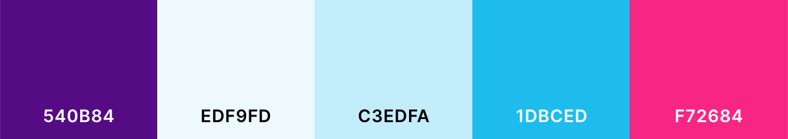

# Playing Around with SASS

Learning more in depth sass.

Includes build in default styling that can be seen by live serving the html file. Also includes library of classes for:

- color palette above in
  - background colors
  - text colors
  - hover colors
  - light and dark variants of colors in palette
- font sizes
- responsive breakpoints
- styled buttons
- cards
- grid system built with flex box
- padding
- margins
- border radius

As well as a lot of commented out notes to myself...

Built following the [Net Ninja Complete Sass Tutorial](https://www.youtube.com/playlist?list=PL4cUxeGkcC9jxJX7vojNVK-o8ubDZEcNb).
